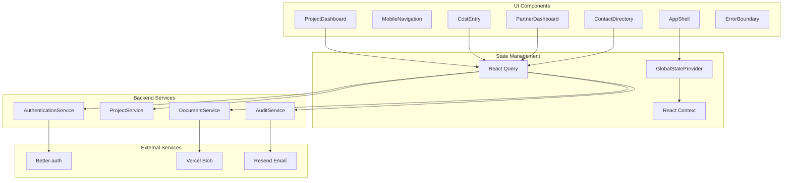

# Components

Based on the architectural patterns, tech stack, and data models defined above, this section defines the component architecture with clear separation between UI components and backend services.

## Frontend Components (UI Layer)

### Core Layout Components

**AppShell**

```typescript
interface AppShellProps {
  children: React.ReactNode
  user: User
  currentProject: Project | null
  notifications: Notification[]
}
```

**Responsibility:** Main application layout with navigation, project context, and global state management
**Technology Stack:** Next.js App Router layout, Shadcn/ui navigation components, React Context for global state

**MobileNavigation**

```typescript
interface MobileNavigationProps {
  currentProject?: Project
  quickActions: QuickAction[]
  onProjectSwitch: (projectId: string) => void
}
```

**Responsibility:** Mobile-optimized bottom navigation with contextual quick actions
**Technology Stack:** Responsive design with Tailwind, Framer Motion for tab transitions

**Sidebar** _(Stories 10.3, 10.11)_

```typescript
interface SidebarProps {
  notificationCount?: number
}

interface NavItem {
  href: Route<string>
  label: string
  icon: LucideIcon
  requiresAuth?: boolean
  badge?: boolean
}
```

**Responsibility:** Primary navigation sidebar with collapsible functionality, user profile management, and tools access
**Technology Stack:** Fixed positioning (z-40), Framer Motion animations (200ms), shadcn/ui components (Avatar, DropdownMenu, Tooltip)
**Features:**

- Collapsible sidebar (256px expanded, 64px collapsed) with hamburger menu toggle in header
- User profile section with avatar (auto-generated initials), name, role display
- User dropdown menu (Profile, Settings, Logout)
- Main navigation items with active route highlighting
- Tools navigation section (Notifications, Settings, Help) with visual divider
- Notification badge indicator (count in expanded state, red dot when collapsed)
- Keyboard shortcut support (Cmd/Ctrl + B to toggle)
- Tooltips in collapsed state for all navigation items
- localStorage persistence of collapse state
- WCAG AA accessibility compliance
  **Z-Index Layering:** z-40 (highest in navigation hierarchy, above TopHeaderBar z-30)

**TopHeaderBar** _(Story 10.10)_

```typescript
interface TopHeaderBarProps {
  notificationCount?: number
  ctaLabel?: string
  ctaAction?: () => void
  onSearchChange?: (query: string) => void
  className?: string
}
```

**Responsibility:** Global header bar providing search, notifications, and quick actions accessible from all pages
**Technology Stack:** Fixed positioning (z-30), Framer Motion animations, responsive design with mobile adaptations
**Features:**

- Global search bar (desktop only, UI placeholder for future functionality)
- Notification button with animated badge indicator
- Context-aware primary CTA button
- Coordinates with Sidebar collapse state (left margin adjustment)
- Mobile adaptations: Hides search/CTA, shows icon buttons
  **Z-Index Layering:** z-30 (below Sidebar z-40, above HorizontalNav z-20)

### Business Components

**ProjectDashboard**

```typescript
interface ProjectDashboardProps {
  projectId: string
  userRole: "admin" | "partner"
  initialData?: ProjectSummary
}

interface ProjectSummary {
  project: Project
  costTotals: CategoryTotal[]
  recentActivity: AuditLog[]
  unreadCount: number
}
```

**Responsibility:** Main project overview with cost summaries, activity feed, and contextual actions
**Technology Stack:** Next.js Server Component for initial data, React Query for real-time updates, Chart.js for cost visualizations

**CostEntry**

```typescript
interface CostEntryProps {
  projectId: string
  onSuccess: (cost: Cost) => void
  defaultCategory?: string
  defaultDate?: Date
}

interface CostFormData {
  amount: number
  description: string
  categoryId: string
  contactId?: string
  date: Date
}
```

**Responsibility:** Mobile-optimized rapid cost entry with smart defaults and offline queue support
**Technology Stack:** React Hook Form with Zod validation, optimistic updates via React Query, offline queue management

**PartnerDashboard**

```typescript
interface PartnerDashboardProps {
  projectId: string
  lastViewedAt?: Date
}

interface PartnerMetrics {
  totalSpent: number
  budgetRemaining: number
  categoryBreakdown: CategoryTotal[]
  recentUpdates: AuditLog[]
}
```

**Responsibility:** Professional read-only interface for partners with real-time updates and activity highlights
**Technology Stack:** Role-based component rendering, animated charts with Framer Motion, automatic refresh via React Query

**ContactDirectory**

```typescript
interface ContactDirectoryProps {
  projectId?: string
  initialCategory?: string
  onSelect?: (contact: Contact) => void
}

interface ContactFilters {
  search: string
  categoryId?: string
  projectId?: string
}
```

**Responsibility:** Hierarchical contact management with search, filtering, and project association
**Technology Stack:** Virtualized lists for performance, Shadcn/ui data tables, debounced search with React Query

### Infrastructure Components

**ErrorBoundary**

```typescript
interface ErrorBoundaryProps {
  fallback: React.ComponentType<ErrorFallbackProps>
  onError: (error: Error, errorInfo: ErrorInfo) => void
  children: React.ReactNode
}

interface ErrorFallbackProps {
  error: Error
  resetError: () => void
  showContactSupport: boolean
}
```

**Responsibility:** Graceful error handling with user-friendly fallbacks and error reporting
**Technology Stack:** React Error Boundaries with custom fallback UI, Sentry integration for error tracking

**GlobalStateProvider**

```typescript
interface GlobalState {
  currentUser: User
  activeProject: Project | null
  offlineQueue: QueuedAction[]
  notifications: Notification[]
  syncStatus: "synced" | "pending" | "conflict"
}
```

**Responsibility:** Global application state management with offline support and real-time synchronization
**Technology Stack:** React Context with useReducer, React Query for server state, localStorage for persistence

## Backend Services (Business Logic Layer)

### AuthenticationService

```typescript
interface AuthenticationService {
  validateSession: (sessionId: string) => Promise<User | null>
  checkProjectAccess: (userId: string, projectId: string) => Promise<boolean>
  createInvitation: (projectId: string, email: string) => Promise<string>
  revokeAccess: (userId: string, projectId: string) => Promise<void>
}
```

**Responsibility:** User authentication, session validation, and role-based access control
**Technology Stack:** Better-auth integration, JWT validation, middleware for tRPC procedures

### ProjectService

```typescript
interface ProjectService {
  create: (data: CreateProjectInput, userId: string) => Promise<Project>
  update: (id: string, data: UpdateProjectInput, userId: string) => Promise<Project>
  softDelete: (id: string, userId: string) => Promise<void>
  getWithPermissions: (id: string, userId: string) => Promise<ProjectWithAccess>
}
```

**Responsibility:** Core project CRUD operations with access control and audit logging
**Technology Stack:** Drizzle ORM with transaction support, automated audit trail creation

### AuditService

```typescript
interface AuditService {
  logAction: (action: AuditAction, context: ActionContext) => Promise<void>
  getActivityFeed: (projectId: string, userId: string) => Promise<AuditLog[]>
  getUnreadCount: (projectId: string, userId: string) => Promise<number>
  markAsViewed: (projectId: string, userId: string) => Promise<void>
}
```

**Responsibility:** Automatic activity tracking with formatted messages for partner transparency
**Technology Stack:** Background job processing, real-time event emission, structured logging

### DocumentService

```typescript
interface DocumentService {
  upload: (file: File, projectId: string, categoryId: string) => Promise<Document>
  generateThumbnail: (imageUrl: string) => Promise<string>
  getSignedUrl: (documentId: string) => Promise<string>
  processMetadata: (file: File) => Promise<FileMetadata>
}
```

**Responsibility:** File upload processing, thumbnail generation, and secure document access
**Technology Stack:** Vercel Blob integration, Sharp image processing, background thumbnail generation

## Component Interaction Patterns

### Event-Driven Communication

```typescript
interface ComponentEventBus {
  emit: <T>(event: ComponentEvent<T>) => void
  subscribe: <T>(eventType: string, handler: EventHandler<T>) => () => void
}

// Examples:
// CostEntry.onSuccess → ProjectDashboard.refreshTotals
// AuditService.newActivity → PartnerDashboard.showNotification
// OfflineQueue.syncComplete → GlobalState.updateSyncStatus
```

### State Management Flow

```typescript
// Server State: React Query manages API data with caching
// Client State: React Context for UI state and user preferences
// Offline State: localStorage with IndexedDB fallback for large data
// Real-time: WebSocket connection for partner dashboard updates
```

## Component Architecture Diagram



---

**Detailed Rationale:**

This refined component architecture provides:

1. **Clear Separation of Concerns:** UI components, state management, and backend services in distinct layers
2. **Concrete TypeScript Interfaces:** Production-ready component contracts with proper typing
3. **Mobile-First Infrastructure:** Offline queue, error boundaries, and optimized mobile navigation
4. **Real-time Architecture:** Event-driven communication and React Query for live updates
5. **Professional Error Handling:** Error boundaries with fallback UI and error reporting integration
6. **Scalable State Management:** Multi-layered state approach optimized for different data types

The architecture directly supports PRD goals through specialized components like CostEntry (mobile optimization), PartnerDashboard (transparency), and AuditService (activity tracking).
