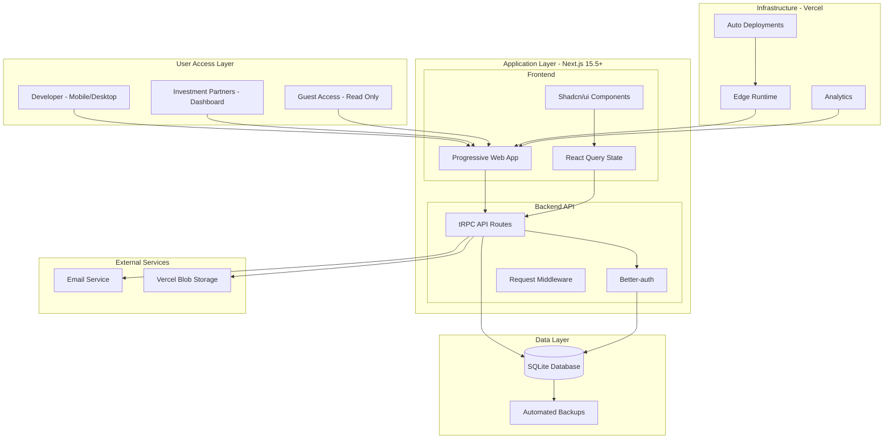

# High Level Architecture

This section establishes the foundation with technical summary, platform infrastructure choices, repository structure, architectural patterns, and system diagram.

## Technical Summary

The Real Estate Development Tracker employs a **modern monolithic fullstack architecture** deployed as a Progressive Web App (PWA). Built on Next.js 15.5+ with App Router, the system leverages **Server Components for optimal performance** and **API routes with tRPC for type-safe client-server communication**. The frontend utilizes **Shadcn/ui components with Tailwind CSS** for professional mobile-first design, while the backend centers around **SQLite with Drizzle ORM 0.44+** for portable, efficient data management. **Vercel provides seamless deployment** with edge runtime support, and **Better-auth handles secure session management**. This architecture achieves the PRD goals of sub-30-second mobile cost entry, instant partner transparency via real-time dashboards, and comprehensive relationship tracking between projects, costs, contacts, and documents.

## Platform and Infrastructure Choice

Based on PRD requirements for rapid development, mobile optimization, and partner transparency, I recommend:

**Option 1: Vercel + SQLite (Recommended)**

- **Pros:** Optimized Next.js hosting, edge runtime, automatic scaling, seamless CI/CD, excellent mobile performance
- **Cons:** Vendor lock-in, SQLite scaling limitations for very large datasets
- **Best for:** Rapid MVP deployment with excellent developer experience

**Option 2: AWS Full Stack**

- **Pros:** Enterprise scalability, full control, comprehensive services, database migration flexibility
- **Cons:** Complex setup, higher operational overhead, slower initial deployment
- **Best for:** Enterprise requirements with dedicated DevOps resources

**Option 3: Self-hosted + Digital Ocean/Hetzner**

- **Pros:** Cost control, full ownership, simple PostgreSQL scaling path
- **Cons:** Manual infrastructure management, deployment complexity, monitoring setup required
- **Best for:** Cost-sensitive deployments with technical operations capability

**Recommendation:** **Vercel + SQLite** for initial deployment, with migration path to Turso (hosted SQLite) or PostgreSQL as scaling needs emerge.

**Platform:** Vercel
**Key Services:** Next.js hosting, Edge Runtime, Serverless Functions, Automatic deployments
**Deployment Host and Regions:** Vercel Global Edge Network (primary: Sydney for Australian users)

**Scaling Strategy:**

- **Triggers:** >50GB database size, >100 concurrent partner sessions, >20 active projects
- **Migration Path:** SQLite → Turso (hosted SQLite) → PostgreSQL on Railway/Supabase
- **Data Portability:** Drizzle migrations ensure zero-downtime database transitions

**Backup Architecture:**

- **Strategy:** GitHub Actions daily SQLite dumps to encrypted S3 bucket
- **Retention:** 30 daily, 12 monthly, 5 yearly backups
- **Recovery:** One-click restoration via Vercel environment variables

## Repository Structure

**Structure:** Turborepo monorepo for optimized builds and shared code management
**Monorepo Tool:** Turborepo with npm workspaces
**Package Organization:** Single Next.js app with shared packages for types and utilities, enabling clean separation between frontend/backend concerns while maintaining type safety

This structure supports the PRD requirement for streamlined development while allowing future scaling to multiple applications (mobile app, admin portal, etc.) if needed.

## High Level Architecture Diagram

## Architectural Patterns

- **Jamstack Architecture:** Static generation with serverless APIs - _Rationale:_ Optimal performance and caching for partner dashboards while maintaining dynamic capabilities for real-time cost updates
- **Component-Based UI:** Reusable Shadcn/ui components with TypeScript - _Rationale:_ Maintainability, accessibility, and consistent professional aesthetics across complex forms and dashboards
- **Repository Pattern:** Abstract data access through Drizzle ORM - _Rationale:_ Enables testing, future database migration flexibility, and clean separation of business logic
- **API Gateway Pattern:** Centralized tRPC router as single API entry point - _Rationale:_ Type safety, automatic validation, centralized auth middleware, and excellent developer experience
- **Progressive Enhancement:** Server Components with client interactivity overlay - _Rationale:_ Mobile performance optimization while maintaining rich interactions for cost entry and partner dashboards
- **Event-Driven Updates:** Real-time cost total updates via Server-Sent Events - _Rationale:_ Instant feedback for developers and transparent partner communication without manual reports

## Notification System Architecture

**Real-time Updates:** Server-Sent Events for cost total changes and partner dashboard updates
**Partner Notifications:** Email digest (daily/weekly configurable) + optional browser push notifications  
**Event Bus:** Simple in-memory queue for MVP, Redis integration path for horizontal scaling
**Delivery Mechanism:** Transactional email via Resend/SendGrid, browser notifications via Web Push API

## Document Storage Architecture

**Document Strategy:**

- **All files:** Vercel Blob storage for scalable, reliable document handling
- **Metadata:** SQLite stores file references, categories, upload dates, and relationships
- **Thumbnails:** Generated and cached in Vercel Blob for quick preview loading
- **Benefits:** Eliminates SQLite bloat, enables CDN delivery, supports large files up to 500MB

## Runtime Distribution Strategy

**Compute Distribution:**

- **Edge Runtime:** Static pages, lightweight API routes, partner dashboards, authentication middleware
- **Node.js Runtime:** File uploads to Vercel Blob, complex database operations, document processing, email sending
- **Client-Side:** Optimistic UI updates, real-time dashboard updates

## PWA and Offline Strategy (Future Enhancement)

**Current MVP Approach:** Online-first web application with responsive design and mobile optimization
**Future PWA Enhancements:**

- **Service Worker:** Cache static assets and critical data for offline browsing
- **Offline Cost Entry:** Local storage queue with background sync when connectivity restored
- **Progressive Enhancement:** Core functionality works offline, advanced features require connection
- **Implementation Timeline:** Phase 2 enhancement after core feature validation

## Authentication Implementation Details

**Better-auth Configuration:**

- **Session Storage:** JWT tokens in httpOnly cookies with 30-day expiration
- **Partner Invitations:** Secure UUID tokens with 7-day expiry, email verification required before access
- **Role-Based Access:** tRPC middleware validates permissions at procedure level, not just UI component hiding
- **Security:** CSRF protection via Next.js, rate limiting on authentication endpoints
