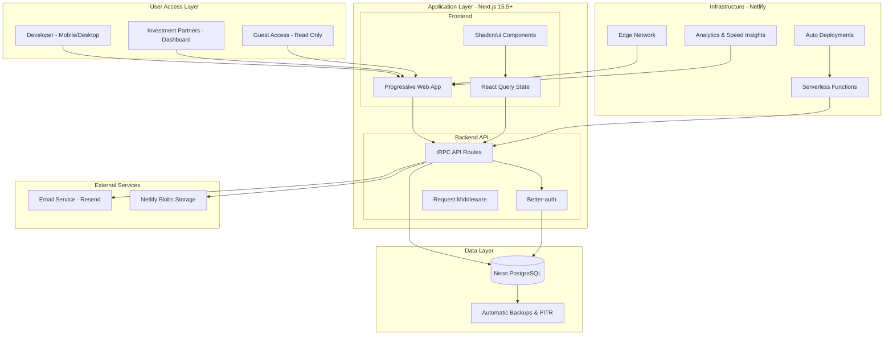

# High Level Architecture

This section establishes the foundation with technical summary, platform infrastructure choices, repository structure, architectural patterns, and system diagram.

## Technical Summary

The Real Estate Development Tracker employs a **modern monolithic fullstack architecture** deployed as a Progressive Web App (PWA). Built on Next.js 15.5+ with App Router, the system leverages **Server Components for optimal performance** and **API routes with tRPC for type-safe client-server communication**. The frontend utilizes **Shadcn/ui components with Tailwind CSS** for professional mobile-first design, while the backend centers around **Neon PostgreSQL (serverless) with Drizzle ORM 0.44+** for scalable, managed data storage with full referential integrity. **Netlify provides seamless deployment** with edge network delivery, serverless functions, and integrated Neon database connectivity, while **Better-auth handles secure session management**. This architecture achieves the PRD goals of sub-30-second mobile cost entry, instant partner transparency via real-time dashboards, and comprehensive relationship tracking between projects, costs, contacts, and documents.

## Platform and Infrastructure Choice

Based on PRD requirements for rapid development, mobile optimization, and partner transparency, the selected platform is:

**✅ Selected: Netlify + Neon PostgreSQL (Production Deployment)**

- **Pros:**
  - Optimized Next.js hosting with zero-config deployment
  - Neon PostgreSQL provides serverless auto-scaling with full ACID compliance
  - Integrated Netlify Blobs for file storage with CDN delivery
  - Automatic preview deployments for every branch/PR
  - Excellent mobile performance via global edge network
  - Database branching for isolated preview environments
  - Built-in form handling and serverless functions
- **Cons:**
  - Platform-specific features (Netlify Blobs, deploy contexts)
  - Less control than self-hosted solutions
- **Best for:** Rapid deployment with enterprise-grade database and scalability
- **Rationale:** See [ADR-001: Neon PostgreSQL vs SQLite](../adr/001-neon-postgresql-choice.md) for detailed decision

**Alternatives Considered:**

**Option 2: Vercel + Neon PostgreSQL**

- Similar serverless PostgreSQL benefits
- Vercel Edge Runtime for global performance
- Not selected: Netlify's integrated approach (Blobs + Functions + Database) provides better cohesion

**Option 3: AWS Full Stack**

- Enterprise scalability with full control
- RDS PostgreSQL or Aurora Serverless
- Not selected: Operational complexity and slower iteration speed

**Option 4: Self-hosted + Digital Ocean/Hetzner**

- Full ownership and cost control
- Self-managed PostgreSQL
- Not selected: Requires dedicated DevOps resources

**Platform:** Netlify
**Key Services:** Next.js hosting, Edge Network, Serverless Functions, Netlify Blobs, Automatic deployments, Form handling
**Database:** Neon PostgreSQL (serverless, auto-scaling, branching support)
**Deployment Host and Regions:** Netlify Global Edge Network (automatically optimized for Australian users)

**Scaling Strategy:**

- **Database:** Neon PostgreSQL auto-scales compute and storage independently
- **Triggers:** Neon handles scaling automatically based on connection pool and query load
- **Migration Path:** Already using PostgreSQL - can migrate to self-hosted PostgreSQL if needed
- **Data Portability:** Standard PostgreSQL dump/restore, Drizzle migrations ensure compatibility

**Backup Architecture:**

- **Database:** Neon provides automatic daily backups with point-in-time recovery (7-day retention on free tier, 30-day on paid)
- **Blob Storage:** Netlify Blobs includes automatic replication and durability
- **Additional Backups:** Optional GitHub Actions workflow for weekly full database exports to encrypted S3
- **Recovery:** Neon console for point-in-time restore, Netlify for blob recovery

## Repository Structure

**Structure:** Turborepo monorepo for optimized builds and shared code management
**Monorepo Tool:** Turborepo with npm workspaces
**Package Organization:** Single Next.js app with shared packages for types and utilities, enabling clean separation between frontend/backend concerns while maintaining type safety

This structure supports the PRD requirement for streamlined development while allowing future scaling to multiple applications (mobile app, admin portal, etc.) if needed.

## High Level Architecture Diagram

## Architectural Patterns

- **Jamstack Architecture:** Static generation with serverless APIs - _Rationale:_ Optimal performance and caching for partner dashboards while maintaining dynamic capabilities for real-time cost updates
- **Component-Based UI:** Reusable Shadcn/ui components with TypeScript - _Rationale:_ Maintainability, accessibility, and consistent professional aesthetics across complex forms and dashboards
- **Repository Pattern:** Abstract data access through Drizzle ORM - _Rationale:_ Enables testing, future database migration flexibility, and clean separation of business logic
- **API Gateway Pattern:** Centralized tRPC router as single API entry point - _Rationale:_ Type safety, automatic validation, centralized auth middleware, and excellent developer experience
- **Progressive Enhancement:** Server Components with client interactivity overlay - _Rationale:_ Mobile performance optimization while maintaining rich interactions for cost entry and partner dashboards
- **Event-Driven Updates:** Real-time cost total updates via Server-Sent Events - _Rationale:_ Instant feedback for developers and transparent partner communication without manual reports

## Notification System Architecture

**Real-time Updates:** Server-Sent Events for cost total changes and partner dashboard updates
**Partner Notifications:** Email digest (daily/weekly configurable) + optional browser push notifications  
**Event Bus:** Simple in-memory queue for MVP, Redis integration path for horizontal scaling
**Delivery Mechanism:** Transactional email via Resend/SendGrid, browser notifications via Web Push API

## Document Storage Architecture

**Document Strategy:**

- **All files:** Netlify Blobs storage for scalable, reliable document handling
- **Metadata:** Neon PostgreSQL stores file references, categories, upload dates, and relationships
- **Thumbnails:** Generated and cached in Netlify Blobs for quick preview loading
- **Environment-aware:** Production uses global store (strong consistency), non-production uses deploy-scoped stores (automatic cleanup)
- **Benefits:** Serverless storage with CDN delivery, supports large construction documents, isolated preview environments

## Runtime Distribution Strategy

**Compute Distribution:**

- **Netlify Edge Functions:** Static pages, lightweight API routes, partner dashboards, authentication middleware (future enhancement)
- **Netlify Serverless Functions (Node.js):** tRPC API routes, file uploads to Netlify Blobs, database operations via Neon, document processing, email sending
- **Client-Side:** Optimistic UI updates, real-time dashboard updates with React Query

## PWA and Offline Strategy (Future Enhancement)

**Current MVP Approach:** Online-first web application with responsive design and mobile optimization
**Future PWA Enhancements:**

- **Service Worker:** Cache static assets and critical data for offline browsing
- **Offline Cost Entry:** Local storage queue with background sync when connectivity restored
- **Progressive Enhancement:** Core functionality works offline, advanced features require connection
- **Implementation Timeline:** Phase 2 enhancement after core feature validation

## Authentication Implementation Details

**Better-auth Configuration:**

- **Session Storage:** JWT tokens in httpOnly cookies with 30-day expiration
- **Partner Invitations:** Secure UUID tokens with 7-day expiry, email verification required before access
- **Role-Based Access:** tRPC middleware validates permissions at procedure level, not just UI component hiding
- **Security:** CSRF protection via Next.js, rate limiting on authentication endpoints
